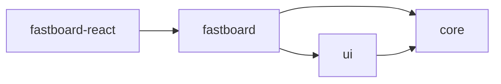

## Project Structure



(dependencies)

```yaml
core: []
ui: [core, preact]
fastboard: [ui, core]
fastboard-react: [fastboard, react@peer]
```

### fastboard-core

All logic related, provides variables and methods for UI to use.

### fastboard-ui

Builtin components, written in whatever framework.
Using fastboard-core, provides base components for other wrapper libraries.

### fastboard

Re-exporting fastboard-core and fastboard-ui.
Provides a `mount()` function to quickly start the whiteboard.

### fastboard-react

Same as the above, but wraps fastboard-ui in React components.
