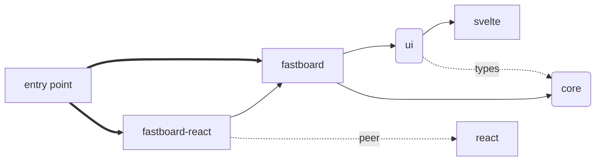
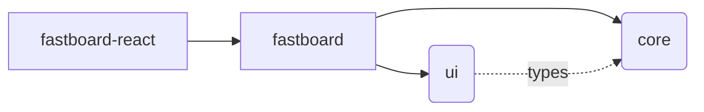

## Structure



简化版 &darr;



1. 用户从 fastboard-react **或者** fastboard 开始使用，一般不需要知道后面 core 和 ui 部分，前两者其实也重新导出了后两者的全部内容。

2. React 是 peer dependency，这是为了保证用户代码全局只存在一份 React，否则函数组件会出现各种问题。这也意味着安装 fastboard-react 时需要同时手动安装 react 才能使用：

   ```bash
   npm add @netless/fastboard-react react react-dom
   ```
