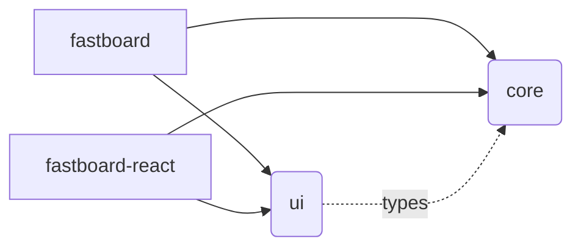

## Structure



### User Guide

Use fastboard-react **or** fastboard, the core and ui part are re-exported from the two entries.

### `fastboard-react`

React is a peer dependency for making sure there's only one React, otherwise react hooks may be broken. You have to install the fastboard-react package like this:

```bash
npm add @netless/fastboard-react react react-dom
```
